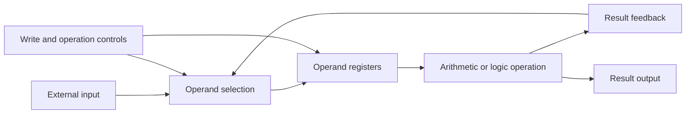
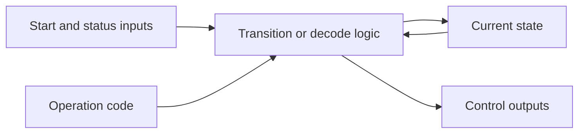

# Datapath and Control Unit Design in VHDL

Datapath and Control Unit Design in VHDL is a collection of fifteen independent digital-design exercises focused on the two fundamental parts of a processing system: the datapath that stores and transforms binary values, and the control unit that coordinates operations over time. The work progresses through register transfers, operand selection, arithmetic and logic processing, comparisons, result feedback, finite-state sequencing, and combinational control-signal generation. Each exercise translates a circuit diagram, state diagram, or truth table into a concise hardware description and can be studied, analyzed, simulated, and synthesized as a self-contained design unit.

## Learning Objectives

The repository demonstrates how to:

- describe combinational and sequential hardware behavior in VHDL;
- model registers controlled by write-enable signals;
- implement falling-edge-triggered state updates;
- select operands through multiplexing and feedback paths;
- express addition, subtraction, comparison, and bitwise operations;
- organize datapaths around arithmetic logic units;
- encode finite-state machines and conditional state transitions;
- derive control signals from states and operation codes;
- translate block diagrams, state diagrams, and truth tables into behavioral architectures.

## Exercise Catalog

Every exercise directory contains one VHDL source file and one PNG image presenting the corresponding design specification.

| Exercise | Design unit | Category | Main behavior |
| --- | --- | --- | --- |
| 01 | `DPath` | Datapath | 16-bit input register, selectable OR or AND operation, and registered result |
| 02 | `Datapath` | Datapath | 8-bit register selection followed by a signed comparison and registered Boolean result |
| 03 | `CU` | Control unit | Three-bit state sequencing controlled by start, readiness, and operation inputs |
| 04 | `DP` | Datapath | 16-bit addition with selectable external or feedback loading of an operand register |
| 05 | `CU` | Control unit | Five-state handshake sequence with operation-dependent branching |
| 06 | `DP` | Datapath | 16-bit ALU with input addition, register addition, and bitwise OR operations |
| 07 | `CU` | Control unit | Three-bit finite-state sequence with branches selected by a two-bit operation code |
| 08 | `DP` | Datapath | 8-bit feedback accumulator supporting addition, bitwise OR, and controlled clearing |
| 09 | `DP` | Datapath | 16-bit add-and-AND ALU with selectable external or result-feedback operand |
| 10 | `DP` | Datapath | 16-bit ALU supporting addition, bitwise OR, minimum selection, and bitwise AND |
| 11 | `CU` | Control unit | Combinational decoder for selection, execution, write, and readiness signals |
| 12 | `CU` | Control unit | Combinational decoder for execution and register-write controls |
| 13 | `CU` | Control unit | Combinational routing and write-control decoder based on state and operation code |
| 14 | `CU` | Control unit | Five-state controller driven by start, operation, readiness, and count conditions |
| 15 | `DP` | Datapath | 8-bit feedback datapath with selectable addition or subtraction |

## Design Model

The datapath exercises combine storage, operand routing, and computation. Their control inputs determine when registers capture values and which operation is applied.



The control-unit exercises implement either clocked state progression or direct combinational decoding.



## Requirements

To analyze and simulate the designs from the command line, install:

- GHDL with VHDL-2008 support;
- a terminal with PowerShell on Windows or a POSIX-compatible shell on macOS and Linux;
- an optional waveform viewer capable of opening GHDL waveform files.

The designs use the IEEE logic packages and, where arithmetic is required, the Synopsys-compatible signed or unsigned logic packages. The commands therefore enable the GHDL Synopsys compatibility mode.

Confirm that GHDL is available:

```text
ghdl --version
```

## Analyze a Design

Open a terminal in the repository root. Analyze every exercise in its own work directory because several independent sources intentionally reuse entity names such as `DP` and `CU`.

### Windows PowerShell

The following example analyzes Exercise 01:

```powershell
$id = "01"
$source = "Exercise $id\exercise_$id.vhd"
$workDirectory = ".ghdl\exercise_$id"

New-Item -ItemType Directory -Force -Path $workDirectory | Out-Null
ghdl -a --std=08 --ieee=synopsys --workdir="$workDirectory" "$source"
```

### macOS and Linux

The equivalent shell commands are:

```sh
id="01"
source_file="Exercise $id/exercise_$id.vhd"
work_directory=".ghdl/exercise_$id"

mkdir -p "$work_directory"
ghdl -a --std=08 --ieee=synopsys --workdir="$work_directory" "$source_file"
```

Replace `01` with any identifier from `02` through `15` to analyze another exercise. Keep a distinct work directory for each identifier throughout analysis, elaboration, and simulation.

## Simulate a Design

The repository provides hardware design units and their graphical specifications. A testbench supplies the clock, input values, control sequences, timing, and assertions required for a simulation.

For the selected exercise:

1. Inspect the PNG specification and the entity declaration in the VHDL source.
2. Create a testbench in the same exercise directory and instantiate the design unit listed in the exercise catalog.
3. Declare the testbench without external ports.
4. Initialize every testbench-driven signal and generate a periodic clock for sequential designs.
5. Drive write controls before checking register-dependent operations, then apply operation codes and input values.
6. Add assertions for the expected values and allow enough simulation time for falling clock edges to occur.

Assuming the Exercise 01 testbench is named `exercise_01_tb.vhd` and its entity is `exercise_01_tb`, run the following commands after completing the analysis step.

### Windows PowerShell

```powershell
$id = "01"
$workDirectory = ".ghdl\exercise_$id"
$testbench = "Exercise $id\exercise_${id}_tb.vhd"
$testbenchEntity = "exercise_${id}_tb"

ghdl -a --std=08 --ieee=synopsys --workdir="$workDirectory" "$testbench"
ghdl -e --std=08 --ieee=synopsys --workdir="$workDirectory" $testbenchEntity
ghdl -r --std=08 --ieee=synopsys --workdir="$workDirectory" $testbenchEntity --assert-level=error --wave="$workDirectory\exercise_$id.ghw" --stop-time=1us
```

### macOS and Linux

```sh
id="01"
work_directory=".ghdl/exercise_$id"
testbench="Exercise $id/exercise_${id}_tb.vhd"
testbench_entity="exercise_${id}_tb"

ghdl -a --std=08 --ieee=synopsys --workdir="$work_directory" "$testbench"
ghdl -e --std=08 --ieee=synopsys --workdir="$work_directory" "$testbench_entity"
ghdl -r --std=08 --ieee=synopsys --workdir="$work_directory" "$testbench_entity" --assert-level=error --wave="$work_directory/exercise_$id.ghw" --stop-time=1us
```

Adjust the stop time to match the stimulus duration. The generated GHW file records the simulated signals for waveform inspection. Repeat the same workflow with the matching identifier, entity, source, and testbench for every exercise.

## Verification Strategy

Use the following checks to validate each class of design:

- For register-based datapaths, load known operands, select each supported operation, trigger the required falling edge, and compare the result with the expected arithmetic or bitwise value.
- For feedback datapaths, establish the initial register values before performing a sequence of dependent operations.
- For comparison logic, include lower, equal, and greater operand relationships.
- For finite-state controllers, cover every outgoing condition, self-loop, branch, and return path shown in the state diagram.
- For combinational control units, apply every state and operation-code combination represented by the truth table and check all outputs.
- Use assertions in each testbench so that an incorrect result terminates the simulation with a nonzero status.

## Cleaning Generated Files

GHDL places analyzed libraries and waveform files inside the `.ghdl` directory used by the commands above. Remove that generated directory when a clean workspace is required.

Windows PowerShell:

```powershell
Remove-Item -Recurse -Force -LiteralPath ".ghdl"
```

macOS and Linux:

```sh
rm -rf -- ".ghdl"
```
